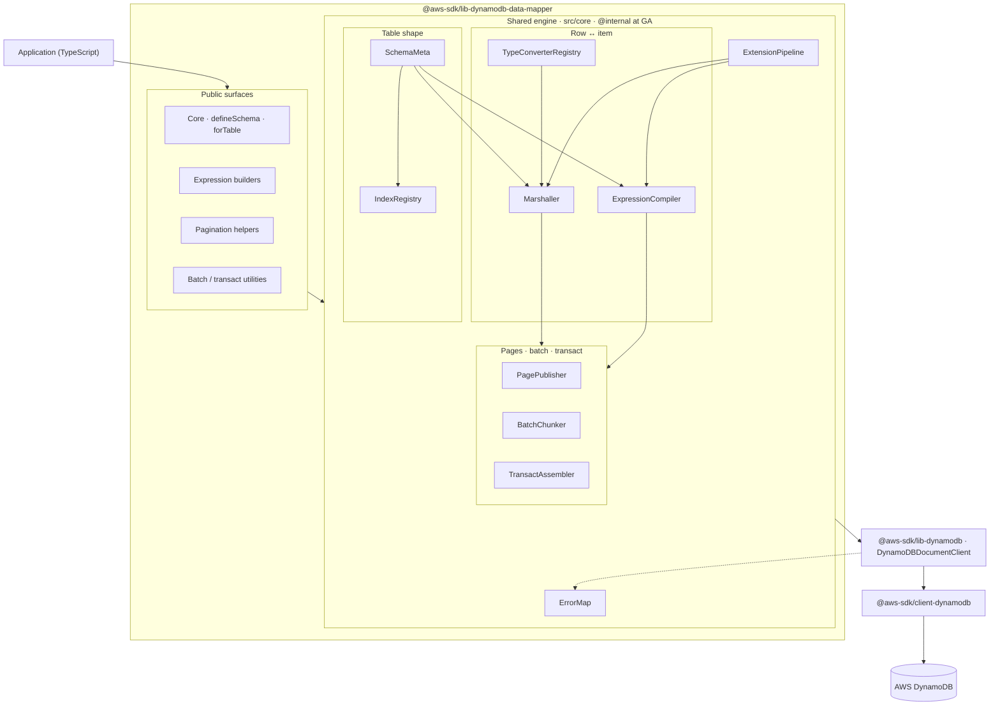
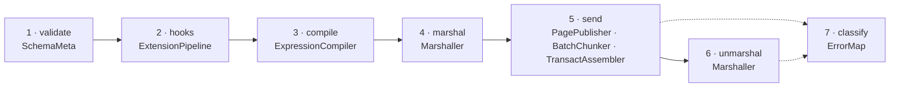

# First-party DynamoDB High Level Client for AWS SDK for JavaScript v3

### Stakeholders

**Owners:** Lucian Lature / Endava Team

**Primary Reviewers:** DynamoDB Service Team

**Secondary Reviewers:** AWS SDK for JavaScript Team

### Document Phase

**Review ready (design review).** This document fixes **which capabilities ship** and in which phase, but seeks confirmation of phase sequencing, per-deliverable effort, and the engineering path to GA (**~120 wd** estimated total effort, including program buffer). The program does not lock a single caller-facing API: the same deliverables can ship behind a schema-first high level client shape, a document-oriented high level client shape, or both over time.

## Problem Statement

### The gap

JavaScript and TypeScript teams using DynamoDB have two AWS-supported options today: the low-level client (verbose, service-shaped) and the document client (plain objects in attribute-value form). Inside that family, the remaining gap is a supported way to define a clear data shape once and reuse it across reads and writes in a consistent, type-safe way. The archived AWS Labs DataMapper addressed this on v2, however v3 still holds a seat for a first-party successor.

### The cost of the gap

Until AWS ships a default mapping layer, customers fill the space with community libraries, internal helpers, or repeated document-client patterns in each service. Documentation, training, and safety all fragment as a result. npm trends still point the same way: the archived Labs DataMapper keeps a steady flow of monthly installs, and roughly one in four teams that use `lib-dynamodb` also pull in a higher-level DynamoDB abstraction that AWS does not own. [Appendix F](#f-npm-download-volume-and-community-wrapper-demand) holds the full download tables and the March 2026 wrapper breakdown. [Appendix D](#d-companion-sentiment-bundle) summarizes the qualitative friction behind those numbers.

### The decision

AWS should ship an official high level client as an **additive, opt-in** package on `DynamoDBDocumentClient`: typed create, read, update, delete, and query for the common case, with strong typing, repeatable behaviour, and the same escape hatch teams already use on the document client. That gives one coherent adoption story, safe operational defaults, and a place to evolve best practices without changing the DynamoDB service API.

### Why now

Backend and serverless adoption in JavaScript/TypeScript is mature. Internal teams increasingly expect schema-driven data access (as in relational ORMs) before they hand-roll low-level calls. A first-party high level client on v3 aligns DynamoDB with that bar: shorter time-to-first-success and a single supported narrative for docs, samples, and training, all these on the same release train as `@aws-sdk/lib-dynamodb`.

### Has a similar problem existed or been solved before

Java and .NET already ship first-party enhanced clients. Labs DataMapper proved the pattern on v2 before archival left a succession gap on v3. Community libraries (Toolbox, ElectroDB, Dynamoose) show demand, but they cannot replace an AWS-owned default on `@aws-sdk/*` with named ownership, support, and lifecycle aligned to other v3 libraries. This program targets GA as first-party software, not Labs-only delivery.

## Tenets

Teams already trust the document client for credentials, IAM, and the path to DynamoDB. This program adds an optional layer on that same stack (`@aws-sdk/lib-dynamodb` → `DynamoDBDocumentClient` → generated client), so the foundation does not change when a service opts in. Adoption stays reversible: pin the package or stop importing it, and existing call sites keep working.

[Appendix K](#k-program-plan-product-engineering) is the contract for what we build and when. One scope, eight engineering phases (0–7) plus a program buffer, one supported delivery at GA. The list fixes capabilities, not a single caller-facing style (schema-first and document-oriented shapes can deliver the same work), and it deliberately excludes automatic GSI routing, DAX bundled inside the high level client package, and production table provisioning as the default operations story.

Modelling stays in plain TypeScript: `defineSchema({ attributes, indexes })` with inference, without decorator requirements, so serverless bundles and mixed JS/TS repos can adopt without extra compiler ceremony. [Appendix E](#e-schema-functions-over-decorators-and-java-comparator) explains the Java comparator and why that choice fits this ecosystem.

Security and operations inherit from the document client, that means the same credentials, IAM, TLS, and logging defaults, while the high level client adds typed validation context and keeps item payloads and secrets out of default logs. At GA the program delivers document mapping and everyday DynamoDB work: typed access, expression helpers, pagination, batch and transact chunking, optimistic locking when declared, hooks where appropriate, and explicit index names on every query. [Committed Scope](#committed-scope) below and [Appendix C](#c-api-surface-illustrative) sketch illustrative API shape only.

## Intended Customer Experience

### What we are launching

An additive package family (working name `@aws-sdk/lib-dynamodb-<mapper layer>`) above the document client: a **core high level client** for schema-first typed CRUD and query, plus **modular helpers** for expressions, pagination, and batch/transact that teams can adopt together or independently. The target is Java Enhanced–style elevation.

Delivery is **one program, eight engineering phases plus buffer, one GA outcome.** [Appendix K](#k-program-plan-product-engineering) lists every deliverable, its phase, and per-phase estimated effort in working days.

**Phase 0** (5 wd) aligns the program: scope sign-off, SDK and DynamoDB review owners, and Local CI with a publish pipeline stub. **Phase 1** (15 wd) ships the first installable build on the npm preview channel with primary-index get, put, update, delete, and query, validation and service errors, and the escape hatch on the same document client. **Phase 2** (22 wd) adds GSI and LSI query, expression builders, pagination, optimistic locking, and performance CI baselines.

**Phase 3** (19 wd) broadens reads and writes with scan, parallel scan, batch and transact helpers, multi-table utilities, and async iteration. **Phase 4** (16 wd) adds table lifecycle helpers, extensions and hooks, return values, and update modes. **Phase 5** (16 wd) completes schema depth (converters, nested and document paths, async pages) and locks the subpath packaging decision.

**Phase 6** (10 wd) is the release candidate: API freeze, migration guide, parity documentation, and perf gates on every PR. **Phase 7** (6 wd) is general availability with a named AWS owner and a supported release on the normal `@aws-sdk/*` cadence. A **program buffer** of 10 wd covers review and release-train slip.

Customers see incremental preview-channel releases through Phases 1 to 5. **GA** after Phases 0–7 and the program buffer is the only supported product delivery (~**120 wd** estimated engineering plus buffer, detail in [Appendix K](#k-program-plan-product-engineering)).

### Key benefits

Teams gain an AWS-backed elevated path alongside the JavaScript v3 packages they already ship, in the same spirit as enhanced clients on Java and .NET. A squad can start with one service, prove value there, and expand when the library earns trust, or walk away without rewriting the rest of the estate. When a call does not belong in the high level client, the same document client they use today is still one step away.

### Why use the high level client

Most teams already repeat the same work on every feature: shaping keys, stitching expressions, and hoping conditions still match the table. A first-party high level client turns that into shared rules so new services inherit the same behaviour instead of copying snippets from an older repo. That lowers the chance of quiet mistakes on indexes and conditions, gives AWS a single place to document the common path, and still leaves room for community libraries where teams have already standardised on them.

### How to use it

Configure `DynamoDBDocumentClient` as today. **Define the schema** with `defineSchema` or another similar API shape, then **bind a table name** to that schema and the client. Use the table handle for typed get, put, update, delete, and query. Modular subpaths (expressions, pagination, batch) can be used with or without the core handle. Full walkthrough: [Appendix C](#c-api-surface-illustrative).

For scan filters, cross-table orchestration, or TTL admin, call `db.send(...)` on the same client.

### How this relates to other AWS services

This program lives entirely on the customer side of the DynamoDB data plane. It does not ask the service team to change APIs or table behaviour. `@aws-sdk/client-dynamodb` and `@aws-sdk/lib-dynamodb` remain the foundation, with the same IAM model teams already operate under. DAX stays a customer choice: point the document client at a cluster endpoint when acceleration helps, without pulling DAX into the high level client package. Traces and metrics continue through the middleware customers already attach. Teams that standardized on a community library can keep it alongside this one where that still makes sense.

## Important Design Decisions and Tradeoffs

The program ships as its own package beside `@aws-sdk/lib-dynamodb`, not folded into it. That trades an extra package to own and document for room to iterate in preview phases and for teams to adopt or roll back without touching every document-client consumer. We considered folding mapping into `lib-dynamodb`, pushing it into generated clients, or reviving Labs code unchanged. A sibling package keeps the boundary clear.

Modelling starts with an explicit schema: a small upfront definition buys consistent types and safer upgrades, while teams that want full control can still call the document client directly. The exact caller-facing shape stays open until RC. Delivery is a core high level client plus helpers that teams can take in steps—expression, pagination, batch, and locking utilities first where that is enough, the full client when it has proved its value. Preview feedback points toward neutral modelling with AWS-owned helpers rather than a mandated style.

Scope stays deliberately narrow: document mapping and everyday DynamoDB operations at GA, not a full database framework. Packaging may split core and helpers across subpaths or separate npm artifacts (decided in Phase 5). Expression builders ship as part of the program so teams are not left hand-rolling strings, and every query names its index and supplies key conditions, so there is no automatic GSI routing. Schema evolution rules must be spelled out as the API matures: forward-compatible reads by default, stricter modes for greenfield work, and no silent data loss when attributes appear, disappear, or rename.

Before GA, performance is measured against the document client in CI, preview channels follow semver discipline, and the public API freezes only after that evidence. [Appendix J](#j-poc-micro-benchmark) summarises benchmark work. [Appendix G](#g-community-libraries-vs-proposed-first-party-high-level-client-illustrative-comparison), [Appendix I](#i-acquisition-alternatives-adaptation-to-document-client-and-aws-sdk), and [Appendix F](#f-npm-download-volume-and-community-wrapper-demand) cover community comparison and adopt-versus-greenfield analysis.

## Committed Scope

**GA is the single product delivery**, reached through **Phases 0–7 and a program buffer** (eight engineering phases plus buffer, **~120 wd** estimated total effort). [Appendix K](#k-program-plan-product-engineering) is the authoritative list of what ships in each phase and with what effort. The summary below groups that list for readers of this design document.

Every high level client request uses the application’s configured `DynamoDBDocumentClient`—same `send`, retries, middleware, credentials, and region behaviour, with no second pipeline.

**Committed at GA (via phased delivery in [Appendix K](#k-program-plan-product-engineering)):** `defineSchema` and `forTable`, typed get, put, update, delete, and query on the primary key (and sort key where present), named GSI/LSI query with explicit index and key condition, expression and condition and update builders, pagination, batch and transact chunking, optimistic locking via a declared version attribute, lifecycle hooks, distinct high level client vs service errors, scan and parallel scan, table lifecycle helpers for dev and test, nested and document schema depth, converters, and packaging choices frozen at RC.

**Always reachable on the same document client:** TTL writes, advanced conditionals, transactions, and any operation the high level client does not wrap. Omission from the public API is not a prohibition on the underlying client.

**Not on the committed deliverable list:** automatic GSI routing, a mandated full ORM, a DAX-specific module bundled in the program package, decorator-only schemas, streams mapping as a first-class program feature, or production table creation as the default way teams manage infrastructure (Phase 4 table helpers target dev, test, and samples, with IaC as the production default).

## High Level Design



Public surfaces call into one shared engine before every `send(Command)`. The engine modules in the diagram are internal at GA (`src/core/*`, not exported). A second caller-facing shape later would reuse the same engine without duplicating wire logic.

A typical read or write follows the same story. The library checks the row against the table definition, runs any hooks the team registered, builds keys and expressions, converts the row to DynamoDB’s wire shape, and hands the command to the same document client the application already uses. Paged queries, batch calls, and transactions reuse that path through the shared paging and chunking helpers. When something fails, the library classifies whether the problem came from validation or from the service, and keeps the original service error available for existing handlers. Module layout, a per-step flow diagram, and illustrative interfaces are in [Appendix A](#a-architecture-illustrative).

Teams keep their own observability stack. The program does not require a specific vendor or agent. Hooks around operations could exist so teams can inject tracing or metrics where they already do today. When a use case falls outside the library, the application can still call the low-level or document client directly on the same configured client. Illustrative types are in [Appendix B](#b-typings-illustrative). An end-to-end API walkthrough is in [Appendix C](#c-api-surface-illustrative).

### Design limitations

The committed list targets production-shaped document mapping, not every enterprise pattern. Items outside [Appendix K](#k-program-plan-product-engineering) stay off this program unless leadership explicitly widens the charter. Bundle size and import cost are first-class and measured in CI. PoC code under `lib/lib-dynamodb-data-mapper/src` is an internal spike only and does not define scope or schedule.

### Dependencies taken

Inherits retries and throttling from the configured client. DynamoDB Local in CI for integration tests. Publish on the npm preview channel until RC, then normal `@aws-sdk/`* cadence. SDK + DynamoDB review bandwidth and change board after Phase 2 exit; 10 wd program buffer for release-train slip. DynamoDB **service** API unchanged—client-side only.

## Rollout and Rollback Strategy

Each phase ships incremental capability on npm preview tags (semver-minor until RC). RC freezes API and publishes migration guide (Labs v2, document client, coexistence with community libs). GA on `^1.x` with named AWS owner.

**Rollback:** remove the high level client import, keep document client, finally pin a prior preview-channel release if needed. No data migration is needed. Breaking changes after GA: major bump per SDK policy.

## Impact of the Design

Customers keep the same credentials, IAM, and logging assumptions they already use with the document client. The library adds validation context but does not put item payloads or secrets in default logs, and error messages are written so they do not leak sensitive fields. Documentation will include practical IAM examples for common access patterns.

The library runs in the application process like any other npm dependency. Teams can keep their existing tracing and metrics middleware on the document client. Runbooks will describe when to stay on the high level client and when to call the document client directly for operations the library does not wrap.

We will prove the library in CI with unit and integration tests against DynamoDB Local, checks at each phase exit, and performance comparisons to the document client from Phase 2 onward. Before we publish overhead or bundle-size targets, those numbers need to pass agreed gates in CI. Golden migration tests land with the release candidate.

Nothing changes on the DynamoDB service API. Existing tables, indexes, transactions, TTL, streams, encryption, and DAX usage behave the same on the wire. DAX remains a customer configuration on the document client endpoint, not a dependency bundled into this package. A second caller-facing API, codegen from shared schema metadata, or ecosystem adapters would be follow-on work only if there is clear demand and funding after GA.


## Key Feedback

No blocking feedback recorded yet. When feedback arrives, record provider(s), status (ACCEPT / REJECT / ESCALATE), escalators, and reason.


## Appendix

### Guide

**Contents:** [A](#a-architecture-illustrative) · [B](#b-typings-illustrative) · [C](#c-api-surface-illustrative) · [D](#d-companion-sentiment-bundle) · [E](#e-schema-functions-over-decorators-and-java-comparator) · [F](#f-npm-download-volume-and-community-wrapper-demand) · [G](#g-community-libraries-vs-proposed-first-party-high-level-client-illustrative-comparison) · [H](#h-estimation-and-priority-labels) · [I](#i-acquisition-alternatives-adaptation-to-document-client-and-aws-sdk) · [J](#j-poc-micro-benchmark) · [K](#k-program-plan-product-engineering) · [L](#l-template-sections-omitted-from-impact) · [M](#m-poc-code-in-repo)

- **Committed features, phasing, and effort:** [Appendix K](#k-program-plan-product-engineering).
- **Demand signals (downloads, community totals):** [Appendix F](#f-npm-download-volume-and-community-wrapper-demand).
- **Community libraries (capabilities):** [Appendix G](#g-community-libraries-vs-proposed-first-party-high-level-client-illustrative-comparison).
- **Java Enhanced comparator (schema mapping):** [Appendix E](#e-schema-functions-over-decorators-and-java-comparator).
- **Sentiment corpus:** [Appendix D](#d-companion-sentiment-bundle).
- **Acquisition / greenfield:** [Appendix I](#i-acquisition-alternatives-adaptation-to-document-client-and-aws-sdk).

---

### A. Architecture (Illustrative)

The elevated client sits above the document client. Generated clients stay unchanged. The library wraps them in place and keeps a single source of generated code. The layer is modular: a core package plus expression builders, pagination helpers, and batch/transaction utilities (separate npm packages, stable subpath exports under one umbrella, or both—decided at Phase 5).

```
┌──────────────────────────────────────────────────────────┐
│            Application Code (TypeScript)                 │
└───────────────────────────┬──────────────────────────────┘
                            │
┌───────────────────────────▼──────────────────────────────┐
│       @aws-sdk/lib-dynamodb-data-mapper                  │
│  ┌────────────────────────────────────────────────────┐  │
│  │ Core                                               │  │
│  │ defineSchema · tables · typed CRUD/query · hooks · │  │
│  │ optimistic locking · typed errors                  │  │
│  └────────────────────────────────────────────────────┘  │
│  ┌────────────────────────────────────────────────────┐  │
│  │ Expression & condition builders                    │  │
│  │ safe conditions · updates · filters                │  │
│  └────────────────────────────────────────────────────┘  │
│  ┌────────────────────────────────────────────────────┐  │
│  │ Pagination helpers                                 │  │
│  │ query/scan pages · LastEvaluatedKey · iteration    │  │
│  └────────────────────────────────────────────────────┘  │
│  ┌────────────────────────────────────────────────────┐  │
│  │ Batch & transaction utilities                      │  │
│  │ chunking · retries · transact limits               │  │
│  └────────────────────────────────────────────────────┘  │
└───────────────────────────┬──────────────────────────────┘
                            │ wraps (extends in place)
┌───────────────────────────▼──────────────────────────────┐
│              @aws-sdk/lib-dynamodb                       │
│        DynamoDBDocumentClient (auto-marshall)            │
└───────────────────────────┬──────────────────────────────┘
                            │
┌───────────────────────────▼──────────────────────────────┐
│             @aws-sdk/client-dynamodb                     │
│   Low-level client · Smithy middleware                   │
└───────────────────────────┬──────────────────────────────┘
                            │
                       AWS DynamoDB
```

The four boxes in the diagram are **public surfaces** (core handle, expression builders, pagination, batch/transact). Under them sits one **shared engine** that every surface reuses. Today’s PoC inlines key steps in `schema.ts` and `table.ts` (key composition, strip `pk`/`sk`, hand-built update expressions). GA moves that work behind small interfaces under `src/core/*` so a future second caller-facing shape could share the same engine without rewriting wire logic.

#### Shared engine (illustrative)

A table handle is thin: it holds `SchemaMeta`, engine services, and `DynamoDBDocumentClient`. `defineSchema` (or any later DSL) compiles into `SchemaMeta`. Structural layering matches the [High Level Design](#high-level-design) diagram above (public surfaces → shared engine → document client).

Per-operation flow through the engine:



**SchemaMeta** is the canonical description of a table: logical attributes, storage names, nested document paths, defaults, and version-attribute flags. Surfaces never pass raw schema objects to the wire layer; they compile into `SchemaMeta` once per `forTable` binding. Validation, projection lists, and “what belongs on this row” all read from here.

**IndexRegistry** (usually owned by `SchemaMeta`) records primary, GSI, and LSI geometry: which storage fields hold keys, which logical fields form each composite, and how values join (for example `#` in single-table layouts). Query and scan code resolves `IndexName` and key inputs through the registry. The program does not auto-pick an index: the caller names it; the registry supplies storage field names and composite rules.

**TypeConverterRegistry** holds built-in and custom converters (`Date`, `Set`, encrypted strings, money-as-integer). **Marshaller** walks `SchemaMeta`, applies converters, and produces document-client items and keys. It also strips stored key attributes on read so callers see the logical row shape. One marshaller path serves Put, Get, Update, Query, and Scan.

**ExpressionCompiler** turns a shared expression AST into DynamoDB `ExpressionAttributeNames`, `ExpressionAttributeValues`, and expression strings. Condition, key, update, and projection builders on the public surface are DSLs only; they all compile through this module so `#n0` / `:v0` allocation and logical-to-storage name mapping stay consistent.

**ExtensionPipeline** runs ordered hooks and built-ins (version checks, timestamps, UUID fill, atomic counters, user `beforePut` handlers). Extensions see a draft command input before `send` and can mutate the item or attach conditions.

**PagePublisher** owns `LastEvaluatedKey` loops, parallel scan segments, and async iteration over query/scan pages with consistent unmarshalling per page. **BatchChunker** splits BatchGet/BatchWrite at service limits and retries `UnprocessedItems`. **TransactAssembler** builds transact write/read inputs within the 100-item cap and attaches compiled conditions per item.

**ErrorMap** separates library validation errors from DynamoDB service errors, preserves the original SDK error on `cause`, and maps well-known failures (conditional check failed, transaction canceled, strict not-found) without leaking item payloads into messages.

At GA these modules stay **`@internal`**: not listed in `package.json#exports`. Each module exposes a narrow interface (`SchemaMeta`, `Marshaller`, `ExpressionCompiler`, and so on) so the public surface depends on contracts, not concrete classes. If a second caller-facing shape is funded later, extraction to a shared package is mechanical.

Illustrative internal layout:

```
src/core/
  schema-meta/     SchemaMeta, AttributeMeta, defaults
  index/           IndexRegistry, IndexMeta, key parts
  convert/         TypeConverterRegistry
  marshal/         Marshaller
  expression/      ExprAst, ExpressionCompiler
  extension/       ExtensionPipeline, built-in extensions
  pagination/      PagePublisher
  batch/           BatchChunker
  transact/        TransactAssembler
  errors/          ErrorMap, library error types
```

Illustrative interfaces (names and shapes may change):

```typescript
interface SchemaMeta {
  readonly tableName: string;
  readonly attributes: ReadonlyMap<string, AttributeMeta>;
  readonly indexes: IndexRegistry;
}

interface IndexRegistry {
  primary(): IndexMeta;
  get(logicalName: string): IndexMeta | undefined;
  resolveKey(index: IndexMeta, keyInput: Record<string, unknown>): Record<string, unknown>;
}

interface Marshaller {
  toItem(row: unknown, meta: SchemaMeta): Record<string, unknown>;
  fromItem(item: Record<string, unknown>, meta: SchemaMeta): unknown;
  toKey(keyInput: unknown, index: IndexMeta): Record<string, unknown>;
}

interface ExpressionCompiler {
  compileCondition(ast: ExprAst, meta: SchemaMeta): CompiledExpression;
  compileKeyCondition(ast: ExprAst, index: IndexMeta): CompiledExpression;
  compileUpdate(ast: ExprAst, meta: SchemaMeta): CompiledExpression;
}

interface ExtensionPipeline {
  use(ext: Extension): void;
  execute(point: HookPoint, ctx: ExtensionCtx): Promise<void>;
}

interface PagePublisher {
  pagesOfQuery(input: QueryDraft, ctx: ReadCtx): AsyncIterable<Page<unknown>>;
}

interface BatchChunker {
  batchGet(keys: unknown[], ctx: ReadCtx): Promise<unknown[]>;
  batchWrite(writes: WriteRequest[], ctx: WriteCtx): Promise<void>;
}

interface TransactAssembler {
  assemble(items: TransactItem[], ctx: WriteCtx): TransactWriteInput;
}

interface ErrorMap {
  classify(err: unknown, ctx: { operation: string }): never;
}
```

End-to-end typed example: [Appendix C](#c-api-surface-illustrative).

### B. Typings (Illustrative)

Declaration sketch for the `attributes` + `indexes` shape used in [Appendix C](#c-api-surface-illustrative). Attributes hold business fields only. `indexes.primary` maps DynamoDB pk/sk attribute names to composite attribute names. Incomplete on purpose: shipping adds GSIs, overloads, and stricter update/query key shapes.

```typescript
import type { DynamoDBDocumentClient } from "@aws-sdk/lib-dynamodb";

type DynamoScalar = "string" | "number" | "boolean" | "binary";

interface FieldDef<T extends DynamoScalar, K extends string | undefined = undefined> {
  type: T;
  key?: K;
  versionAttribute?: boolean;
}

type InferAttrType<T extends DynamoScalar> = T extends "string"
  ? string
  : T extends "number"
    ? number
    : T extends "boolean"
      ? boolean
      : Uint8Array;

type SchemaFields<A extends Record<string, FieldDef<DynamoScalar, any>>> = {
  [K in keyof A]: A[K] extends FieldDef<infer T, any> ? InferAttrType<T> : never;
};

type PrimaryIndex = {
  pk: { field: string; composite: readonly string[] };
  sk: { field: string; composite: readonly string[] };
};

type SchemaWithPrimaryIndex = {
  attributes: Record<string, FieldDef<DynamoScalar, undefined>>;
  indexes: { primary: PrimaryIndex };
};

declare function defineSchema<const S extends SchemaWithPrimaryIndex>(schema: S): S;

type RowSchema<S extends SchemaWithPrimaryIndex> = SchemaFields<S["attributes"]>;

type KeyInput<S extends SchemaWithPrimaryIndex> = Pick<
  RowSchema<S>,
  | S["indexes"]["primary"]["pk"]["composite"][number]
  | S["indexes"]["primary"]["sk"]["composite"][number]
>;

interface ForTableOptions {
  client: DynamoDBDocumentClient;
}

type HookName = "beforePut";

interface TableHandle<S extends SchemaWithPrimaryIndex> {
  put(item: RowSchema<S>): Promise<void>;
  get(key: KeyInput<S>): Promise<RowSchema<S> | undefined>;
  delete(key: KeyInput<S>): Promise<void>;
  query(
    key: Pick<RowSchema<S>, S["indexes"]["primary"]["pk"]["composite"][number]> &
      Partial<Pick<RowSchema<S>, S["indexes"]["primary"]["sk"]["composite"][number]>>
  ): AsyncIterable<RowSchema<S>>;
  update(
    partitionKey: RowSchema<S>[S["indexes"]["primary"]["pk"]["composite"][0]],
    patch: { set: Partial<RowSchema<S>> }
  ): UpdateBuilder<S>;
  on<E extends HookName>(
    event: E,
    handler: E extends "beforePut" ? (item: RowSchema<S>) => void : never
  ): void;
}

interface UpdateBuilder<S extends SchemaWithPrimaryIndex> {
  condition(expr: ConditionExpr<S>): this;
  execute(): Promise<void>;
}

type ConditionExpr<S extends SchemaWithPrimaryIndex> = (api: { attr: AttrApi<S> }) => unknown;

type AttrApi<S extends SchemaWithPrimaryIndex> = {
  [K in keyof RowSchema<S>]: {
    exists(): unknown;
  };
};

declare function attr(name: string): { exists(): unknown };

declare function forTable<S extends SchemaWithPrimaryIndex>(
  tableName: string,
  schema: S,
  options: ForTableOptions
): TableHandle<S>;
```

### C. API Surface (Illustrative)

Sketches illustrate style only; names and signatures may change before ship. Part one: core (`defineSchema`, `forTable`, typed table operations). Part two: modular helpers as separate imports.

**Core**

```typescript
const UserSchema = defineSchema({
  attributes: {
    userId: { type: "string" },
    profileKey: { type: "string" },
    name: { type: "string" },
    email: { type: "string" },
    version: { type: "number", versionAttribute: true },
  },
  indexes: {
    primary: {
      pk: { field: "pk", composite: ["userId"] },
      sk: { field: "sk", composite: ["profileKey"] },
    },
  },
});

const UserTable = forTable("UserTable", UserSchema, { client });

await UserTable.put({
  userId: "user#123",
  profileKey: "profile",
  name: "Alice",
  email: "alice@example.com",
  version: 1,
});

const user = await UserTable.get({ userId: "user#123", profileKey: "profile" });

await UserTable.update("user#123", { set: { name: "Bob" } })
  .condition((api) => api.attr("email").exists())
  .execute();

await UserTable.delete({ userId: "user#123", profileKey: "profile" });

for await (const item of UserTable.query({ userId: "user#123" })) {
  // item: { userId, profileKey, name, email, version }
}

UserTable.on("beforePut", (item) => {
  if (!item.email) throw new Error("email required");
});
```

**Modular helpers**

```typescript
import { QueryCommand } from "@aws-sdk/client-dynamodb";
import type { DynamoDBDocumentClient } from "@aws-sdk/lib-dynamodb";
import { buildKeyCondition, buildUpdateParts } from "@aws-sdk/lib-dynamodb-data-mapper/expressions";
import { pagesOfQuery } from "@aws-sdk/lib-dynamodb-data-mapper/pagination";
import { transactWriteChunks } from "@aws-sdk/lib-dynamodb-data-mapper/batch";

const { keyCondition, exprNames, exprValues } = buildKeyCondition((b) =>
  b.partition("pk").eq("user#123")
);

const updateParts = buildUpdateParts((u) => u.set("name", "Bob").ifVersion("version", 3));

for await (const page of pagesOfQuery(docClient, { TableName: "UserTable" })) {
  for (const item of page.Items ?? []) {
    /* each unmarshalled item */
  }
}

await transactWriteChunks(docClient, [
  { Put: { TableName: "UserTable", Item: { pk: "user#123", sk: "profile", name: "A", email: "a@ex", version: 1 } } },
  { Delete: { TableName: "UserTable", Key: { pk: "user#456", sk: "profile" } } },
]);
```

### D. Companion Sentiment Bundle

Full JSON corpus and headline sentiment: [gist](https://gist.github.com/lucianlature-endava/98e5058ee7b549d283a505eae64e647e).

### E. Schema Functions Over Decorators and Java Comparator

**Schema functions over decorators**

TypeScript decorators are usually the wrong default for a DynamoDB elevated client in the JS/TS SDK:

- **Operational and build friction:** extra compiler settings and sometimes runtime metadata across Node versions, bundlers, and test runners.
- **Ecosystem mismatch:** plain objects + type inference work in serverless, edge bundling, and mixed JS/TS repos.
- **Tree-shaking and modularity:** decorators push class-based, reflective patterns; harder to keep the library small and composable.
- **Escape to lower layers:** additive composition with `DynamoDBDocumentClient` stays obvious with schema functions.
- **Versioning risk:** decorator APIs are harder to evolve across early phases; functional schemas stabilize more cleanly.

Reference: [gist.github.com/lucianlature-endava/bcecc19ce515e4c0fd428cd4c37c7b9e](https://gist.github.com/lucianlature-endava/bcecc19ce515e4c0fd428cd4c37c7b9e).

**Java Enhanced Client vs proposed JS elevated client (schema mapping)**

Binding a type to a table uses `@DynamoDbBean` in Java vs `defineSchema({ attributes, indexes })` and `forTable(tableName, schema, { client })` in JS.

Partition keys map from `@DynamoDbPartitionKey` to `indexes.primary.pk.composite` and `indexes.primary.pk.field`.

Sort keys map from `@DynamoDbSortKey` to `indexes.primary.sk.composite` and `indexes.primary.sk.field`.

Secondary index keys use `@DynamoDbSecondaryPartitionKey` / sort-key annotations in Java vs explicit entries under `indexes` in JS, with the caller naming `IndexName` and the key condition.

Stored attribute names override via `@DynamoDbAttribute("name")` in Java vs `field` on each index leg in JS.

Ignored properties use `@DynamoDbIgnore` in Java vs omitting the field from `attributes` in JS.

Optimistic locking uses `@DynamoDbVersionAttribute` in Java vs `versionAttribute: true` on a numeric attribute in JS.

Dynamic per-request table names have various Java patterns; JS treats this as a Phase 5 candidate if demand is confirmed.

Schema reuse in Java uses class extension and annotations; JS uses composition of plain attribute and index fragments.

### F. npm Download Volume and Community-Wrapper Demand

The naïve ratio (archived Labs DataMapper against the entire aws-sdk v2 package) is misleading because v2 bundles every AWS service. Directional comparisons still help: in 2024 archived Labs DataMapper averaged ~100K downloads/month against ~41M for aws-sdk v2 (0.24%). In 2025 ~113K vs ~37M (0.31%). In March 2026 ~115K vs ~41M (0.28%).

**DynamoDB-only v3 clients (closer comparison):** archived Labs DataMapper (~~115K/month) vs `@aws-sdk/client-dynamodb` (~~26M/month) and `@aws-sdk/lib-dynamodb` (~16M/month), roughly 0.44% and 0.73% respectively.

**Total higher-level abstraction demand (March 2026, npm):** ElectroDB leads at ~2.28M downloads (59%), Dynamoose ~767K (20%), DynamoDB-Toolbox ~455K (12%), OneTable ~142K (4%), archived Labs DataMapper ~115K (3%), TypedORM ~80K (2%), Nova fork ~24K (1%). Combined ~3.86M downloads.

That total is ~~14.8% of estimated `client-dynamodb` users and ~24.3% of estimated `lib-dynamodb` users (~~one in four `lib-dynamodb` installs alongside a community higher-level wrapper).

**Notes:** Archived Labs DataMapper still sees ~115K/month with no first-party v3 successor. Share of v2 rose from 0.24% (2024) to 0.31% (2025) while v2 declined. SDK team feedback: v2 Labs DataMapper users were generally satisfied. The gap is the missing **v3** successor on `@aws-sdk/`*, not lack of appetite for an elevated client.

### G. Community Libraries vs Proposed First-Party High Level Client (Illustrative Comparison)

**Ownership:** the proposed `@aws-sdk/lib-dynamodb-data-mapper` ships with the JavaScript SDK family. ElectroDB, DynamoDB-Toolbox, and Dynamoose are community-owned.

**Release alignment:** the first-party package follows the same cadence as `@aws-sdk/lib-dynamodb`. Community libraries release independently.

**Default AWS path in docs and training:** the elevated client can become the documented common case. Community options remain third-party in official AWS material.

**Primary modeling style:** schema-first with a typed table handle (proposed) vs access-pattern / single-table orientation (ElectroDB), schema definitions with Entity/Table (Toolbox), or model-centric documents (Dynamoose).

**Scope (committed program):** CRUD/query, conditions, hooks, locking, and modular helpers for the proposed client; richer entity/query APIs (ElectroDB); flexible entities (Toolbox); document-layer models (Dynamoose).

**Escape hatch to `DynamoDBDocumentClient`:** first-class on the same stack (proposed); supported via the AWS SDK underneath for all three community options.

**Opinion on single-table design:** neutral (proposed); strong opinions (ElectroDB); flexible (Toolbox and Dynamoose).

Community libraries earned their download share. The investment case is an official, supportable default on v3, not displacing the ecosystem.

### H. Estimation and Priority Labels

**M** = medium (governance / ~~3 wd). **L** = large (~~15–22 wd engineering track). **S** = small (~5–10 wd). Effort words in [Appendix I](#i-acquisition-alternatives-adaptation-to-document-client-and-aws-sdk) (small / medium / large / extra-large) are relative sizing only, not calendar commitments.

### I. Acquisition Alternatives (Adaptation to Document Client and @aws-sdk/*)

For a hypothetical acquisition (AWS buys a library instead of greenfielding): how hard to adapt it to `@aws-sdk/client-dynamodb` + `@aws-sdk/lib-dynamodb` + `DynamoDBDocumentClient.send(...)`, then ship under `@aws-sdk/`*? Assumptions: TypeScript-first, 50/50 single-table and multi-table workloads.

**I.1 Reference design (proposed first-party elevated client)**

- Schema values, not decorators: `defineSchema({ attributes, indexes })`.
- Table binding: `forTable(tableName, schema, { client })`.
- Wire path: every call is still `DynamoDBDocumentClient.send(SomeCommand)` with the same marshalling family as `@aws-sdk/lib-dynamodb`.
- Modular escape: expression builders, pagination, batch helpers compose with the same client.

**I.2 Summary ranking**

1. **DynamoDB-Toolbox (v2)** — strongest fit: command builder over the same AWS SDK surface; closest to Entity + schema + `.build(…Command).send()`; medium-high learning curve; technically strong as `@aws-sdk/`*.
2. **ElectroDB** — moderate adaptation: v3 docs center `DynamoDBClient` and need a formal `DynamoDBDocumentClient` matrix; partial fit (access-pattern-first vs neutral table-per-entity); medium learning curve; moderate ship-as-`@aws-sdk/`* case.
3. **Dynamoose** — weakest wire alignment: service-style `ddb` config vs `send(Command)` everywhere; farthest from the reference design (Mongoose-like models); low curve for Mongoose users; weakest technical ship case.

**I.3 Mapping to reference design**

**DynamoDB-Toolbox** matches Entity + Table + schema validation that emits AWS SDK commands. It diverges with richer validation/transforms than the committed program promises; single-table design is a strength, not mandatory.

**ElectroDB** matches entity model, indexes, composite templates, and one-table binding. It diverges with access-pattern-first APIs, fluent `.patch()… .go()`, and library metadata on items (e.g. `__edb_`*).

**Dynamoose** matches schema + `model()` for typed-ish documents. It diverges because the documented path is service-style `ddb` configuration, not `send(Command)` everywhere.

**I.4 Deep comparison axes**

- **Wire stack:** Toolbox expects the same peer packages and command-first examples. ElectroDB documents v3 with `DynamoDBClient`; acquisition needs a supported `DynamoDBDocumentClient` matrix. Dynamoose is closest to low-level client service class, not document client as primary abstraction here.
- **50/50 single-table vs multi-table:** ElectroDB markets single-table design. Toolbox and Dynamoose are more table-centric / neutral for multi-table teams.
- **Learning curve:** Toolbox rewards strict TypeScript. ElectroDB adds access-pattern vocabulary. Dynamoose is gentle for Mongoose immigrants.
- **Ship as @aws-sdk/*:** Toolbox: fewest architectural surprises when renamed and in-tree. ElectroDB: ship-able with program cost to neutralize positioning and formalize DocumentClient. Dynamoose: ship-able only with heavy engineering toward command-centric paths.

**I.5 Committed capability parity and effort (qualitative)**

- **Additive `DynamoDBDocumentClient` only:** large (greenfield); parity with small packaging (Toolbox); medium–large gap for DocumentClient CI (ElectroDB); large–extra-large gap (Dynamoose).
- **Schema-first API (`defineSchema` / `forTable`):** extra-large (greenfield); parity with medium rename/subset (Toolbox); medium–large to neutralize single-table defaults (ElectroDB); medium–large reshape (Dynamoose).
- **Primary index typed CRUD/query:** large (greenfield); parity, small–medium (Toolbox, ElectroDB, Dynamoose).
- **GSI/LSI explicit `IndexName` query:** large–extra-large (greenfield); parity, medium (Toolbox); strong parity, small–medium (ElectroDB); parity, medium (Dynamoose).
- **Expression / pagination / batch / locking / errors:** medium–large each (greenfield); mostly parity with small–medium gaps (Toolbox); mostly parity with medium product cost (ElectroDB); partial, medium–large (Dynamoose).

**Net effort (indicative):** Greenfield and adopt-Toolbox both **large–extra-large** with different work (capability vs governance/rename). Adopt ElectroDB or Dynamoose is **extra-large** if strict `DynamoDBDocumentClient.send(Command)` is mandatory everywhere.

**I.6 Decision pull-through**

Default program: **greenfield** aligned to this design (max API control, IP/release clarity, v3 tenets). Acquisition paths (e.g. Toolbox) deserve review only if leadership prioritizes time-to-first-supported-release and accepts license, renaming, API subsetting, and long-term maintenance of concepts AWS did not originate.

### J. PoC Micro-Benchmark

Four DynamoDB access layers (raw `DynamoDBDocumentClient`, DynamoDB Toolbox, ElectroDB, Dynamoose) against one table with fixed pk/sk and shared item shape. Each stack runs in its own AWS Lambda (`CSM_aws-sdk-js-v3_StackBenchPut_{raw,toolbox,electrodb,dynamoose}`, Node.js 20.x, 4096 MB, 900s timeout), invoked sequentially.

Each Lambda runs a time-bounded PutItem-only phase: one untimed primer, warmup puts, then measured puts (strictly sequential, one `await` per iteration). Keys spread across 16 shards by default. Each measured put publishes `PutLatency` (ms) to CloudWatch (`aws-sdk-js-v3`, dimensions `ClientType=StackBench`, `Stack`, `Size`, `OperationName=PutItem`, `Platform=lambda`).

**Representative result (eu-west-1, Size=Small, Platform=lambda):** raw ≈ 4.8 ms. ElectroDB ≈ 4.9 ms (~~+2% vs raw). DynamoDB Toolbox ≈ 5.2 ms (~~+8% vs raw). Dynamoose ≈ 6.3 ms (~+31% vs raw). Service-side time is effectively constant across stacks (except Dynamoose’s bridge path). Ordering reflects client-side mapping cost.

### K. Program Plan (Product Engineering)

For program leadership (planning, resourcing, go/no-go gates). This appendix is the **authoritative delivery plan**: phased milestones, **per-deliverable effort in working days**, and a derived total effort to GA.

**Scope**

- **In scope:** every committed feature of `@aws-sdk/lib-dynamodb-data-mapper` core, grouped by engineering phase, plus RC and GA.
- **Not in scope:** dirty tracking by default, automatic GSI routing, DAX bundling inside the high level client package, or any optional layer outside the committed deliverable list below. Caller-facing API shape (schema-first vs document-oriented) is not fixed by this program.

**Unit:** All durations and per-item effort are in **working days (wd)** of engineering effort (1 week = 5 wd). This appendix does **not** project calendar dates. Calendar planning depends on staffing and parallelism decided by program management.

**Assumptions (revisit when scope changes)**

- Phases are mostly **sequential**. Phase 2 performance CI can overlap late Phase 1.
- **Scope contract** is Java Enhanced parity as defined by the deliverables in this appendix. Scope changes go through change board after Phase 2 exit.
- **Preview publish:** npm `@aws-sdk/lib-dynamodb-data-mapper` on the preview channel after Phase 1 exit.
- **GA definition:** API freeze, migration guide, perf CI gates, named AWS owner, support runbooks.

**Pre-kickoff engineering:** Any code already under `lib/lib-dynamodb-data-mapper/src` is an **internal spike only**. Do not treat it as a baseline, a demo of GA scope, or evidence that any phase deliverable is done.

#### Phase summary

- **Phase 0 — Alignment & CI,** estimated effort **5 wd.** Customer milestone: scope sign-off, repo and Local CI wired.
- **Phase 1 — Core CRUD + primary query,** estimated effort **15 wd.** Customer milestone: installable preview on npm, primary index only.
- **Phase 2 — Indexes, expressions, pagination,** estimated effort **22 wd.** Customer milestone: GSI/LSI query, builders, paged query.
- **Phase 3 — Scan, batch, transact,** estimated effort **19 wd.** Customer milestone: read breadth, write batching, transactions.
- **Phase 4 — Control plane & extensions,** estimated effort **16 wd.** Customer milestone: table lifecycle, locking, hooks, extensions.
- **Phase 5 — Schema depth & async,** estimated effort **16 wd.** Customer milestone: nested/document path, converters, async pages, packaging decision.
- **Phase 6 — RC: freeze, perf, migration,** estimated effort **10 wd.** Customer milestone: API freeze, perf gates, migration guide.
- **Phase 7 — GA: ownership & support,** estimated effort **6 wd.** Customer milestone: supported GA on normal `@aws-sdk/`* cadence.
- **Program buffer,** estimated effort **10 wd.** Review slip and release train.

**Total estimated effort to GA:** **~120 wd** (109 wd across Phases 0–7 + 10 wd program buffer).

---

#### Phase 0: Alignment & CI (estimated effort 5 wd)

- **0.1** Deliverables ↔ phase mapping signed (this design document, committed scope, and appendix). **Effort: 3 wd.**
- **0.2** SDK/DDB review owners, npm preview semver policy. **Effort: —**
- **0.3** DynamoDB Local integration in CI, publish pipeline stub. **Effort: 2 wd.**

**Exit:** Phase 1 work authorized. Net-new API changes require a change-board ticket and an update to the committed deliverable list in this appendix.

---

#### Phase 1: Core high level client (estimated effort 15 wd)

- **1.1** Describe a table's shape once and get a typed handle for working with it (`defineSchema`, `forTable`). **Effort: 5 wd.**
- **1.2** Save, fetch, and delete a single record by its primary key. **Effort: 2 wd.**
- **1.3** Change selected fields of an existing record without rewriting the whole record. **Effort: 2 wd.**
- **1.4** List records that share the same primary key, with optional ordering and range refinement. **Effort: 2 wd.**
- **1.5** Clear, typed error when an item does not match the declared shape. **Effort: —**
- **1.6** DynamoDB service errors surface unchanged, so existing error handling keeps working. **Effort: 1 wd.**
- **1.7** Automated tests against a local DynamoDB and a first installable preview build on npm. **Effort: 3 wd.**
- **1.8** Library lives in the official AWS SDK for JavaScript repo and ships on the same release process. **Effort: —**
- **1.9** For anything the library does not cover, the underlying `DynamoDBDocumentClient` remains available alongside, with no extra wiring (escape hatch). **Effort: —**

**Deferred to Phase 2+:** conditions on all paths, GSI, scan, batch, transact, table lifecycle, extensions.

**Exit:** Dogfoodable Phase 1: primary-index CRUD + query only on the npm preview channel.

---

#### Phase 2: Indexes, expressions, pagination (estimated effort 22 wd)

- **2.1** Declare secondary indexes in the schema and query each by name (explicit index, no auto-routing). **Effort: 5 wd.**
- **2.2** Express conditions (e.g. only update if status is still pending) using a typed builder, not hand-written DynamoDB strings. **Effort: 3 wd.**
- **2.3** Express key lookup criteria (equals, greater than, between, begins-with) using a typed builder. **Effort: —**
- **2.4** Express update operations (set, add, remove, append to a list) using a typed builder, with an escape hatch for unusual cases. **Effort: 4 wd.**
- **2.5** Choose exactly which fields to read back from DynamoDB (projection). **Effort: 2 wd.**
- **2.6** Walk through large result sets in chunks, with a next-page cursor and per-page information. **Effort: 3 wd.**
- **2.7** Common query knobs: post-fetch filtering, sort direction, strongly-consistent reads. **Effort: —**
- **2.8** Builders automatically translate schema field names into DynamoDB expression attribute names. **Effort: 2 wd.**
- **2.9** Mark one field as a version counter so concurrent writers cannot silently overwrite each other. **Effort: —**
- **2.10** Bypass the version check on a specific call when the caller intentionally forces a write. **Effort: —**
- **2.11** Expose expression builders as a separate, optional import. **Effort: 3 wd.**
- **2.12** Performance benchmarks (save and query) on every change, compared against the bare AWS client, with thresholds that block regressions from merging. **Effort: —**

**Exit:** Phase 2: production-shaped reads/writes on primary + named indexes. Expression builders suitable for preview consumers.

---

#### Phase 3: Scan, batch, transact (estimated effort 19 wd)

- **3.1** Read every record in a table (full table sweep), returned with the same typed shape as a normal query. **Effort: 5 wd.**
- **3.2** Read every record through a secondary index. **Effort: 2 wd.**
- **3.3** Split a full table sweep across several workers, for faster large reads (parallel scan). **Effort: 3 wd.**
- **3.4** Iterate over query and scan results page by page using standard `for await` loops instead of manual paging. **Effort: —**
- **3.5** Fetch many records in a single call; automatic chunking to DynamoDB limits and retry of partial failures. **Effort: 3 wd.**
- **3.6** Save or delete many records in a single call, with the same automatic chunking and retry. **Effort: —**
- **3.7** One call that batches across several tables at once. **Effort: 2 wd.**
- **3.8** Per-table options (projection, strong consistency) when fetching across multiple tables. **Effort: —**
- **3.9** Read or write a group of items as a single all-or-nothing transaction, including cross-item condition checks. **Effort: 4 wd.**
- **3.10** One call that runs a transaction spanning multiple tables. **Effort: —**
- **3.11** Optionally publish batch and transaction code as a separate import. **Effort: —**

**Exit:** Phase 3: parity with Java Enhanced on data-plane batch, transact, and scan (minus control plane).

---

#### Phase 4: Control plane & extensions (estimated effort 16 wd)

- **4.1** Create the DynamoDB table directly from the schema, and wait until it is ready to accept traffic. **Effort: 4 wd.**
- **4.2** "Make sure this table exists" and "make sure this table is gone" helpers, safe to call repeatedly (tests and local dev). **Effort: —**
- **4.3** Delete a table and wait until the deletion is complete. **Effort: 2 wd.**
- **4.4** Declare or add secondary indexes when creating or updating the table. **Effort: —**
- **4.5** Configure on-demand vs provisioned billing, server-side encryption, and change streams at table creation. **Effort: 3 wd.**
- **4.6** Plug-in mechanism for user logic before and after every read and write, in a defined order. **Effort: 1 wd.**
- **4.7** Hooks at specific moments (e.g. right before a save) for enrichment or validation. **Effort: 2 wd.**
- **4.8** Built-in helpers: auto-fill ID, created-at / updated-at timestamps, atomic counter increments. **Effort: —**
- **4.9** Save only if the record does not already exist, plus declarative rules for how updates treat missing fields. **Effort: —**
- **4.10** Save and delete can optionally return the previous version of the record. **Effort: 4 wd.**
- **4.11** Configurable rules when an update targets a field that is not yet set (Java SDK alignment). **Effort: —**
- **4.12** Opt-in strict mode: fetching a non-existent record throws a typed error instead of returning undefined. **Effort: —**

**Exit:** Phase 4: table bootstrap for dev/test/samples and cross-cutting write extensions documented. Production table management remains IaC-first.

---

#### Phase 5: Schema depth, packaging, async (estimated effort 16 wd)

- **5.1** Custom rules for storing and loading individual fields (encrypted strings, custom date formats, money as integers). **Effort: 4 wd.**
- **5.2** Describe records with nested objects (user with address, order with line items) directly in the schema. **Effort: 3 wd.**
- **5.3** First-class support for DynamoDB set, map, and list field types in the schema. **Effort: —**
- **5.4** Build large schemas by combining smaller reusable schema pieces. **Effort: 3 wd.**
- **5.5** One-line opt-in for auto-generated primary keys, plus a hook for a custom ID generator. **Effort: —**
- **5.6** Works cleanly with immutable data styles without forcing mutable patterns. **Effort: —**
- **5.7** Environment prefix on every table name (dev-, staging-, sandbox-) so application code does not hard-code environment. **Effort: 3 wd.**
- **5.8** Streaming-style results for query and scan for users who prefer a publisher API over iteration. **Effort: —**
- **5.9** Resolve the table name at runtime (per-tenant table) if demand is confirmed during review. **Effort: 3 wd.**
- **5.10** Finalise packaging: separate npm packages, stable subpath exports under one umbrella, or both. **Effort: —**

**Exit:** Phase 5: schema feature set complete (nested attributes, document schema path, converters, sets/maps/lists, async pages, subpath packaging). Async path dogfoodable.

---

#### Phase 6: RC (estimated effort 10 wd)

- **6.1** API freeze, semver policy for 1.x. **Effort: 4 wd.**
- **6.2** Migration guide (Labs DataMapper, Toolbox, raw document client). **Effort: 3 wd.**
- **6.3** Error taxonomy frozen (high level client vs service). **Effort: —**
- **6.4** Perf CI gates enforced on PR. **Effort: 3 wd.**
- **6.5** Public docs and samples aligned to this appendix and committed scope. **Effort: —**

**Exit:** Release candidate tagged. No breaking changes without major-bump policy.

---

#### Phase 7: GA (estimated effort 6 wd) and program buffer (estimated effort 10 wd)

- **7.1** Named AWS owner and support runbooks. **Effort: 2 wd.**
- **7.2** GA npm on normal `@aws-sdk/`* release train. **Effort: 2 wd.**
- **7.3** Maintenance status = active, supported. **Effort: 2 wd.**
- **Buffer** Program buffer (reviews, release train slip). **Effort: 10 wd.**

**Exit:** Supported GA package on the standard SDK cadence.

---

#### GA effort calculator

```
effort_to_GA = sum(phase estimated efforts) + program_buffer
             = 5 + 15 + 22 + 19 + 16 + 16 + 10 + 6 + 10
             = 119 wd  (~120 wd rounded for planning)
```

Calendar dates are out of scope for this appendix.

#### Delivery backlog rollup

Use as the program checklist. Detail lives in the phase sections above.

- **Phase 1:** Primary CRUD + query + preview publish on npm.
- **Phase 2:** GSI/LSI query + condition/key/update/projection builders + pagination + version locking + perf CI.
- **Phase 3:** Scan + parallel scan + batch + transact (+ multi-table helpers).
- **Phase 4:** Table lifecycle + extensions/hooks + return values + update modes.
- **Phase 5:** Converters + nested/document schema + async pages + packaging.
- **Phase 6 (RC):** Freeze + migration + docs + perf gates.
- **Phase 7 (GA):** Ownership + supported release + program buffer.

#### Surface vs phase (summary)

- **Core** (`defineSchema`, `forTable`, primary CRUD/query): required in Phase 1; hardening in Phase 2; API freeze at RC/GA.
- **Expression / condition / update / projection builders:** Phase 2 required; hardening in Phase 3; stable for GA.
- **Pagination helpers:** Phase 2 required; frozen at RC/GA.
- **Explicit GSI/LSI typed query:** Phase 2 required; stable for GA.
- **Scan + parallel scan:** Phase 3 required; frozen at RC/GA.
- **Batch / transact utilities:** Phase 3 required; frozen at RC/GA.
- **Table lifecycle** (create/ensure/delete): Phase 4; frozen at GA.
- **Extensions** (version, counter, UUID, timestamps, hooks): version in Phase 2; hooks in Phase 4; frozen at GA.
- **Error taxonomy** (high level client vs service): draft in Phase 1; written spec in Phase 2; release-blocking at GA.

#### Risks that move the GA effort total

- **Scope creep** (full Java parity plus all schema features pulled into Phase 2): **+20–30 wd** on the GA total.
- **AWS merge / review latency:** **+10–20 wd** (program buffer partly covers).
- **Smithy / codegen churn:** rework concentrated in Phases 2–3.
- **Pre-GA API churn without semver discipline:** adopter cost, may force **+5 wd** in RC.

#### Risk register (execution)

- **Smithy / codegen or middleware churn** breaks high level client assumptions — likelihood medium, impact high — mitigate with early spike and pinning to release-train branches with JS SDK owners.
- **AWS merge policy or repo visibility** delays integration — likelihood medium, impact medium — pre-agree branch/PR policy and ship small mergeable increments.
- **GSI/LSI or expression-builder scope creep** delays GA — likelihood high, impact medium — treat the committed deliverable list as contract; change board after Phase 2 exit.
- **Pre-GA API churn** burns early adopters — likelihood medium, impact high — strict semver on npm preview channels and clear deprecation notes.

### L. Template Sections Omitted from Impact

- **GT (Global Tables):** elevated client does not manage replication; use existing APIs.
- **Keyspaces:** different product; no CQL surface.
- **Elastic views:** no integration.
- **Region Build Automation:** internal AWS process; no customer API.

### M. PoC Code in Repo

Code under `lib/lib-dynamodb-data-mapper/src` is an internal spike only. Do not use it to infer delivery status, API freeze, or benchmark claims.