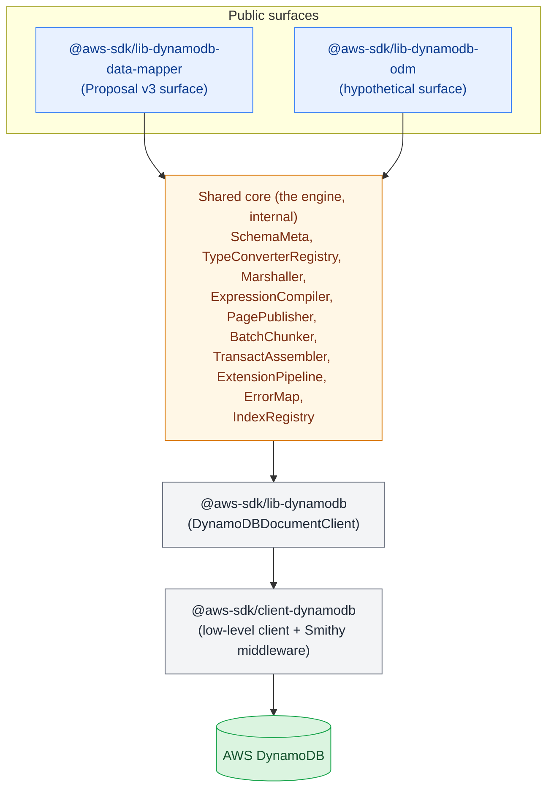

# DataMapper vs ODM: same deliverables, different API shape

> **Hypothetical comparison for review.**
> **DataMapper column** = the proposed `@aws-sdk/lib-dynamodb-data-mapper` product. Phase mapping and ETAs in [`Proposal_v4_roadmap.md`](./Proposal_v4_roadmap.md).
> **ODM column** = hypothetical `@aws-sdk/lib-dynamodb-odm`, modeled on **Dynamoose** patterns. Not a committed product. Explicitly out of scope of the roadmap. No implementation in this repo.
>
> Goal: show that the **same committed deliverable** can take two very different API shapes. Same DynamoDB calls on the wire, different caller code, different ownership of keys and item layout, different refactoring cost when access patterns evolve.

---

## How to read

- One row per committed deliverable on the DataMapper schedule. Section order (§1-§10) groups by capability.
- **Phase column** = preview phase from [`Proposal_v4_roadmap.md`](./Proposal_v4_roadmap.md):
  - `P1` = Preview 1, core CRUD + primary query (T0+8 wk).
  - `P2` = Preview 2, indexes, expressions, pagination, optimistic locking (T0+16 wk).
  - `P3` = Preview 3, scan, batch, transact, async iteration (T0+23 wk).
  - `P4` = Preview 4, control plane and extensions (T0+29 wk).
  - `P5` = Preview 5, schema depth, packaging, async pages (T0+35 wk).
  - `Px/Py` = split between two phases (initial capability in `Px`, completion in `Py`).
  - `—` = no commitment on the DataMapper schedule (opt-in extension, or off-roadmap).
- Out-of-scope items (PartiQL, DAX, attribute-level encryption, decorators-only schemas) are omitted from both columns.
- Snippets are **illustrative API shape**, not full programs. Imports omitted.
- Snippets in table cells are inline code (no syntax highlight on purpose, so they render correctly in every markdown viewer). Multi-line code lives in fenced TS blocks under each table.
- For DataMapper, **`db`** = a `DynamoDBDocumentClient`. For ODM, **`odm`** = a configured `Odm` instance bound to that same document client.

---

## Concrete differences (what the caller writes, what the library hides)

Both columns produce the same DynamoDB calls on the wire. They differ in **what the caller writes**, **what the library composes**, and **how code changes when access patterns evolve**. Every row below is observable in code, not a philosophical claim.

| Question                                               | DataMapper                                                      | ODM                                                                                  |
| ------------------------------------------------------ | --------------------------------------------------------------- | ------------------------------------------------------------------------------------ |
| Where is the partition key declared?                   | `indexes.primary.pk: { field, composite: [...] }` on the schema | Per-attribute flag: `{ type, hashKey: true }`                                        |
| Where is the sort key declared?                        | `indexes.primary.sk: { field, composite: [...], prefix }`       | Per-attribute flag: `{ type, rangeKey: true }`                                       |
| How do you write one row?                              | `await table.put(row).execute()`                                | `await Model.create(item)` or `await doc.save()`                                     |
| How do you change one field?                           | `await table.update(key).set({ field: v }).execute()`           | `doc.field = v; await doc.save()` (dirty tracking decides what to send)              |
| Which index does a query hit?                          | Caller names it: `table.query("byEmail", { email })`            | Library picks it from the queried attribute                                          |
| Where do `Order` line items live on disk?              | Caller models a second row schema, separate `forTable` handle   | Library decides: `L` attribute on the parent item, or split `ITEM#n` rows            |
| What does one `put` translate to on the wire?          | Always one `PutItem`                                            | One `PutItem`, or `TransactWriteItems` if nested arrays map to multiple rows         |
| What does the type system give you on a domain object? | A row type with explicit fields, no `save()` method             | A `Model` instance with `save()`, `delete()`, virtuals, hooks                        |
| Where does validation live?                            | Schema check before SDK call, errors as `MapperValidationError` | Schema check before SDK call, errors as `ValidationError`, `CastError`               |
| How do you turn off the optimistic lock check?         | `.put(row).skipVersionCheck().execute()`                        | `await doc.save({ skipVersion: true })`                                              |
| What changes when you add a new GSI?                   | New entry under `indexes.gsi.<name>` on the schema              | New `index: { name, type: "global" }` on the attribute                               |
| What changes when one item splits into many rows?      | New row schema + new `forTable` + caller rewrites the query     | Schema change can stay opaque, app code may compile unchanged but wire shape changes |
| Closest equivalent in JS ecosystem                     | Repository / DAO pattern, JDBC-shaped                           | Mongoose, Active Record                                                              |

---

## 1. Platform and packaging

| Deliverable                      | Phase | DataMapper                                                                   | ODM                                                                                  |
| -------------------------------- | ----- | ---------------------------------------------------------------------------- | ------------------------------------------------------------------------------------ |
| Ships in official SDK monorepo   | P1    | `npm i @aws-sdk/lib-dynamodb-data-mapper`                                    | `npm i @aws-sdk/lib-dynamodb-odm`                                                    |
| Underlying AWS client            | P1    | `const table = DataMapper.forTable("T", schema, { client: db })`             | `const odm = new Odm({ client: db }); const User = odm.model("User", schema)`        |
| Sync API (Promises)              | P1    | `await table.get({ tenantId, sort }).execute()`                              | `await User.get({ id: "u1" })`                                                       |
| Async iteration                  | P3    | `for await (const row of table.query("primary", { tenantId }).iterate()) {}` | `for await (const u of User.query("status").eq("active")) {}`                        |
| Modular subpaths                 | P5    | `@aws-sdk/lib-dynamodb-data-mapper/expressions`, `/pagination`, `/batch`     | `@aws-sdk/lib-dynamodb-odm/plugins`, `/hooks`, `/transactions`                       |
| Table name prefix                | P5    | `DataMapper.create({ client: db, tableNamePrefix: "prod_" })`                | `new Odm({ client: db, prefix: "prod_" })`                                           |
| Custom user-agent                | P1    | Inherits `db` (per-client option on `DynamoDBDocumentClient`)                | Same: inherits `db`. ODM may also inject `lib-dynamodb-odm/<version>` via middleware |
| Escape hatch to low-level client | P1    | `await db.send(new ScanCommand({ TableName: "T" }))`                         | `await User.rawClient().send(new ScanCommand({ TableName: "T" }))`                   |

---

## 2. Schema and modeling

### Schema definition style (anchor example)

**DataMapper (Proposal v3):** `defineSchema` returns a plain value. Keys and indexes are **visible**.

```ts
const UserSchema = defineSchema({
  attributes: {
    tenantId: { type: "string" },
    userId:   { type: "string" },
    name:     { type: "string" },
    email:    { type: "string" },
    version:  { type: "number", versionAttribute: true },
  },
  indexes: {
    primary: {
      pk: { field: "pk", composite: ["tenantId"] as const },
      sk: { field: "sk", composite: ["userId"]  as const },
    },
    gsi: {
      byEmail: { indexName: "byEmail",
        pk: { field: "gsi1pk", composite: ["email"] as const },
        sk: { field: "gsi1sk", composite: ["userId"] as const } },
    },
  },
});
const Users = DataMapper.forTable("UserTable", UserSchema, { client: db });
```

**ODM (hypothetical, Dynamoose-style):** schema is **document-centric**, keys hidden behind `hashKey`/`rangeKey` flags or computed by the model.

```ts
const userSchema = new Schema({
  tenantId: { type: String, hashKey: true },
  userId:   { type: String, rangeKey: true },
  name:     String,
  email:    { type: String, index: { name: "byEmail", type: "global" } },
  version:  { type: Number, versionKey: true },
});
const User = odm.model("User", userSchema, { tableName: "UserTable" });
```

### §2 row-by-row

| Deliverable                       | Phase | DataMapper                                                                                       | ODM                                                                                             |
| --------------------------------- | ----- | ------------------------------------------------------------------------------------------------ | ----------------------------------------------------------------------------------------------- |
| Schema definition style           | P1    | `defineSchema({ attributes, indexes })` plain function, no decorators                            | `new Schema({...})` + `odm.model(...)`, decorators optional                                     |
| Decorators / annotations required | P1    | Not required. Not the default                                                                    | Not required, but common pattern in TS projects (`@field`, `@hashKey`)                          |
| Partition (hash) key              | P1    | `indexes.primary.pk: { field: "pk", composite: ["tenantId"] }`                                   | `tenantId: { type: String, hashKey: true }`                                                     |
| Sort (range) key                  | P1    | `indexes.primary.sk: { field: "sk", composite: ["userId"] }`                                     | `userId: { type: String, rangeKey: true }`                                                      |
| GSI / LSI declarations            | P2    | Under `indexes.gsi.<name>` / `indexes.lsi.<name>`. Caller passes `IndexName` on query            | Per-attribute `index: { name, type: "global" }`. ODM picks `IndexName` from query attribute     |
| Physical attribute rename         | P1    | `field: "pk"` on the index leg, `field: "..."` on attribute metadata                             | `attribute: "physicalName"` on field options                                                    |
| Ignore property                   | P1    | Omit from `attributes`                                                                           | `select: false` or `internalCache: true`                                                        |
| Nested document on row (`M`)      | P5    | `address: { type: "object", attributes: { city: { type: "string" } } }`                          | `address: { type: Object, schema: { city: String } }`                                           |
| Flatten child to top-level attrs  | —     | Not in core. Model flat fields by hand                                                           | Not in core. Model flat fields by hand                                                          |
| Document / dynamic item schema    | P5    | Separate `defineDocumentSchema(...)` for semi-structured items                                   | `Schema.Types.Mixed` or `dynamic: true` on a sub-schema                                         |
| Sets, maps, lists in schema       | P5    | `{ type: "set", of: "string" }`, `{ type: "list", of: { ... } }`, `{ type: "map", of: { ... } }` | `{ type: Set, schema: [String] }`, `{ type: Array, schema: [...] }`, `{ type: Object, schema }` |
| Auto-generated hash key (UUID)    | P5    | `userId: { type: "string", default: uuid }`                                                      | `userId: { type: String, default: () => uuid(), hashKey: true }`                                |
| Immutable domain models           | P5    | Row types are plain TS, frozen by caller if desired                                              | `Model.set('saveUnknown', false)`, model instances can be made readonly via `toObject()`        |
| Dynamic per-request table name    | P5    | `DataMapper.forTable(dynamicName, schema, { client: db })` per request, or `tableName(fn)`       | `Model.table(name).get(...)` per request                                                        |
| Schema reuse / composition        | P5    | Plain object spread, or `composeSchema(a, b)` helper                                             | `Schema.extend(parent)`, `schema.plugin(fn)`                                                    |
| Custom type converters            | P5    | `{ type: "string", converter: dateConverter }`                                                   | `{ type: Date, get: fn, set: fn }`                                                              |
| Multi-table on one mapper client  | P1    | Many `forTable` handles on one `DataMapper` factory                                              | Many `odm.model(...)` calls on one `Odm` instance                                               |

---

## 3. Single-item operations

| Deliverable                          | Phase | DataMapper                                                                         | ODM                                                                               |
| ------------------------------------ | ----- | ---------------------------------------------------------------------------------- | --------------------------------------------------------------------------------- |
| **PutItem**                          | P1    | `await Users.put({ tenantId, userId, name }).execute()`                            | `await User.create({ tenantId, userId, name })` or `await new User({...}).save()` |
| **GetItem** (`undefined` if missing) | P1    | `const u = await Users.get({ tenantId, userId }).execute(); if (!u) {...}`         | `const u = await User.get({ tenantId, userId }); if (!u) {...}`                   |
| **GetItem** strict mode              | P4    | `await Users.get(key).strict().execute()` throws `ItemNotFoundError`               | `await User.get(key, { throwIfMissing: true })`                                   |
| **UpdateItem** (patch)               | P1    | `await Users.update(key).set({ name: "Ana B" }).execute()`                         | `await User.update(key, { name: "Ana B" })` or `u.name = "Ana B"; await u.save()` |
| **UpdateItem** (raw expr)            | P2    | `await Users.update(key).rawExpression({ UpdateExpression: "SET ..." }).execute()` | `await User.update(key, { $UPDATE: { name: "Ana B" }, $ADD: { count: 1 } })`      |
| **DeleteItem**                       | P1    | `await Users.delete(key).execute()`                                                | `await User.delete(key)` or `await u.delete()`                                    |
| Condition on write/read              | P2    | `.put(row).condition(c => c.attr("version").eq(3)).execute()`                      | `.update(key, patch, { condition: new Condition("version").eq(3) })`              |
| Projection on read                   | P2    | `await Users.get(key).project(["name", "email"]).execute()`                        | `await User.get(key, { attributes: ["name", "email"] })`                          |
| Read consistency                     | P2    | `.get(key).consistent().execute()`                                                 | `User.get(key, { consistent: true })`                                             |
| Return values on put                 | P4    | `const { old } = await Users.put(row).returnValues("ALL_OLD").execute()`           | `await User.create(item, { return: "item" })`                                     |
| Return values on delete              | P4    | `const { old } = await Users.delete(key).returnValues("ALL_OLD").execute()`        | `await User.delete(key, { return: "item" })`                                      |
| `onMissing` for update               | P4    | `.update(key).set(patch).onMissing("REMOVE").execute()`                            | `User.update(key, patch, { settings: { ifMissingRemove: true } })`                |

---

## 4. Read operations (query, scan, pagination)

| Deliverable                     | Phase | DataMapper                                                                 | ODM                                                                           |
| ------------------------------- | ----- | -------------------------------------------------------------------------- | ----------------------------------------------------------------------------- |
| **Query** (primary index)       | P1    | `await Users.query("primary", { tenantId }).execute()`                     | `await User.query("tenantId").eq(t).exec()`                                   |
| **Query** (GSI / LSI)           | P2    | `await Users.query("byEmail", { email }).execute()`                        | `await User.query("email").eq(e).exec()` (ODM picks IndexName from attribute) |
| **Scan** (table)                | P3    | `await Users.scan().execute()`                                             | `await User.scan().exec()`                                                    |
| **Scan** (index)                | P3    | `await Users.scan({ index: "byEmail" }).execute()`                         | `await User.scan().using("byEmail").exec()`                                   |
| **Parallel scan**               | P3    | `await Users.scan().parallel({ totalSegments: 8 }).execute()`              | `await User.scan().parallel(8).exec()`                                        |
| Async item iteration            | P3    | `for await (const u of Users.query("primary", { tenantId }).iterate()) {}` | `for await (const u of User.query("tenantId").eq(t)) {}`                      |
| Page-level iteration            | P2    | `for await (const page of Users.query(...).iteratePages()) {}`             | `for await (const page of User.query(...).pages()) {}`                        |
| Iterator metadata               | P2    | `page.count`, `page.scannedCount`, `page.consumedCapacity`                 | `result.count`, `result.scannedCount`, `result.timesQueried`                  |
| `limit`, `pageSize`, `startKey` | P2    | `.limit(50).startKey(lastKey)`                                             | `.limit(50).startAt(lastKey)`                                                 |
| `filter` expression             | P2    | `.query(...).filter(c => c.attr("active").eq(true)).execute()`             | `User.query(...).filter("active").eq(true).exec()`                            |
| `scanIndexForward`              | P2    | `.query(...).descending().execute()`                                       | `User.query(...).sort("descending").exec()`                                   |

---

## 5. Batch operations

| Deliverable                        | Phase | DataMapper                                                                    | ODM                                                                     |
| ---------------------------------- | ----- | ----------------------------------------------------------------------------- | ----------------------------------------------------------------------- |
| **BatchGetItem** (single table)    | P3    | `await Users.batchGet([k1, k2]).execute()`                                    | `await User.batchGet([k1, k2])`                                         |
| **BatchGetItem** (multi-table)     | P3    | `await DataMapper.batchGet([Users.keys([k1]), Orders.keys([k2])]).execute()`  | `await odm.batchGet([User.toBatchKey(k1), Order.toBatchKey(k2)])`       |
| **BatchWriteItem**                 | P3    | `await Users.batchWrite({ put: [r1, r2], delete: [k3] }).execute()`           | `await User.batchPut([r1, r2]); await User.batchDelete([k3])`           |
| Auto-chunk to 25 / 100 limits      | P3    | Built into `.execute()`                                                       | Built into the corresponding batch methods                              |
| Exponential backoff on unprocessed | P3    | Built in, configurable via `.retry({ maxAttempts, ... })`                     | Built in, configurable via `Model.set('retry', {...})` or global plugin |
| Multi-table batch (one call)       | P3    | `DataMapper.batchWrite([Users.puts([...]), Orders.deletes([...])]).execute()` | `odm.batchWrite([...mixed])`                                            |
| Per-table batch options            | P3    | `Users.batchGet([k]).project(["name"]).consistent()`                          | `User.batchGet([k], { attributes: ["name"], consistent: true })`        |

---

## 6. Transactions

The cells link to fenced examples below the table for the multi-statement ones.

| Deliverable                  | Phase | DataMapper                                                                      | ODM                                                                                             |
| ---------------------------- | ----- | ------------------------------------------------------------------------------- | ----------------------------------------------------------------------------------------------- |
| **TransactGetItems**         | P3    | `await DataMapper.transactGet([Users.keys([k1]), Orders.keys([k2])]).execute()` | `await odm.transaction([User.transaction.get(k1), Order.transaction.get(k2)], { type: "get" })` |
| **TransactWriteItems**       | P3    | see `transactWrite (DataMapper)` below                                          | see `transactWrite (ODM)` below                                                                 |
| `ConditionCheck` in transact | P3    | see `conditionCheck (DataMapper)` below                                         | see `conditionCheck (ODM)` below                                                                |

**transactWrite (DataMapper)**

```ts
await DataMapper.transactWrite([
  Users.put(r1),
  Orders.update(k2).set({ status: "PAID" }),
]).execute();
```

**transactWrite (ODM)**

```ts
await odm.transaction([
  User.transaction.create(r1),
  Order.transaction.update(k2, { status: "PAID" }),
]);
```

**conditionCheck (DataMapper)**

```ts
DataMapper.transactWrite([
  Users.conditionCheck(k1, c => c.attr("version").eq(3)),
  Orders.put(r2),
]);
```

**conditionCheck (ODM)**

```ts
odm.transaction([
  User.transaction.condition(k1, new Condition("version").eq(3)),
  Order.transaction.create(r2),
]);
```

---

## 7. Table and index lifecycle (control plane)

| Deliverable                          | Phase | DataMapper                                                                           | ODM                                                                                        |
| ------------------------------------ | ----- | ------------------------------------------------------------------------------------ | ------------------------------------------------------------------------------------------ |
| **CreateTable** (+ wait active)      | P4    | `await Users.createTable({ waitActive: true, billing: "PAY_PER_REQUEST" })`          | `await User.createTable({ waitForActive: true })` (auto-create on first op also supported) |
| **EnsureTableExists**                | P4    | `await Users.ensureTableExists()`                                                    | `odm.model(..., { create: true, waitForActive: true })` (init-time)                        |
| **DeleteTable** (+ wait)             | P4    | `await Users.deleteTable({ wait: true })`                                            | `await User.deleteTable({ wait: true })`                                                   |
| **EnsureTableNotExists**             | P4    | `await Users.ensureTableNotExists()`                                                 | `await odm.dropIfExists("UserTable")`                                                      |
| **CreateGSI / ensure GSI**           | P4    | Derived from `indexes.gsi.*` on `createTable` / `updateTable`                        | Derived from per-attribute `index: { name, type: "global" }` declarations                  |
| Billing mode, SSE, streams in create | P4    | `Users.createTable({ billing: "PAY_PER_REQUEST", sse: true, streams: "NEW_IMAGE" })` | `User.createTable({ throughput: "ON_DEMAND", encryption: { type: "AWS_OWNED" } })`         |

---

## 8. Expressions and update DSL

| Deliverable                   | Phase | DataMapper                                                                                           | ODM                                                                   |
| ----------------------------- | ----- | ---------------------------------------------------------------------------------------------------- | --------------------------------------------------------------------- |
| Standalone expression subpath | P2    | `import { cond, key, update } from "@aws-sdk/lib-dynamodb-data-mapper/expressions"`                  | `import { Condition } from "@aws-sdk/lib-dynamodb-odm"` (in-package)  |
| Condition expression AST      | P2    | `cond(c => c.attr("status").eq("PAID").and(c.attr("amount").gt(0)))`                                 | `new Condition("status").eq("PAID").and().where("amount").gt(0)`      |
| Update expression AST         | P2    | `update(u => u.set("name", "Ana").add("count", 1))`                                                  | `{ $SET: { name: "Ana" }, $ADD: { count: 1 } }` (mongoose-flavored)   |
| Key condition for Query       | P2    | `key(k => k.pk("tenantId", t).sk(s => s.beginsWith("ORDER#")))`                                      | `User.query("tenantId").eq(t).and().where("sk").beginsWith("ORDER#")` |
| Function / math expressions   | P2    | `update(u => u.add("count", 1).set("name", u.ifNotExists("name", "Anon")))`                          | `{ $ADD: { count: 1 }, name: { $ifNotExists: "Anon" } }`              |
| Projection expression builder | P2    | `project(p => p.fields("name", "email", p.path("address.city")))`                                    | `.attributes(["name", "email", "address.city"])`                      |
| Schema-aware name mapping     | P2    | Builders read from schema. `attr("name")` becomes `#n0` and resolves the physical name automatically | Same idea, via schema metadata                                        |
| Attribute path helper         | P2    | `attr("address.city")`                                                                               | `"address.city"` (string path)                                        |

---

## 9. Optimistic locking, hooks, extensions

| Deliverable                            | Phase | DataMapper                                                                               | ODM                                                                                       |
| -------------------------------------- | ----- | ---------------------------------------------------------------------------------------- | ----------------------------------------------------------------------------------------- |
| Optimistic locking (version attribute) | P2    | `version: { type: "number", versionAttribute: true }`                                    | `version: { type: Number, versionKey: true }`                                             |
| Skip version check per call            | P2    | `Users.put(row).skipVersionCheck().execute()`                                            | `await u.save({ skipVersion: true })`                                                     |
| Lifecycle hooks (before write)         | P4    | `DataMapper.forTable(..., { hooks: { beforePut: (item) => validate(item) } })`           | `userSchema.pre("save", function(next) { ...; next(); })`                                 |
| Atomic counter                         | P4    | `count: { type: "number", atomicCounter: true }` plus `update(...)` increments           | `count: { type: Number, atomic: true }` plus `Model.update({ $INCREMENT: { count: 1 } })` |
| Auto timestamps (created/updated)      | P4    | `defineSchema({ ..., timestamps: { createdAt: true, updatedAt: true } })`                | `new Schema({...}, { timestamps: true })`                                                 |
| Auto UUID generation                   | P4/P5 | `id: { type: "string", default: uuid }` plus `autoGenerate: true` write hook             | `id: { type: String, default: () => uuid(), hashKey: true }`                              |
| Pluggable extension chain              | P4    | `DataMapper.create({ client: db, extensions: [versionExt(), uuidExt(), counterExt()] })` | `odm.use(versionPlugin); odm.use(timestampPlugin); odm.use(uuidPlugin)`                   |
| Write-if-not-exists semantics          | P4    | `.put(row).condition(c => c.attr("pk").notExists()).execute()`                           | `await User.create(item, { overwrite: false })`                                           |

---

## 10. Errors and observability

| Deliverable                       | Phase | DataMapper                                                            | ODM                                                                                 |
| --------------------------------- | ----- | --------------------------------------------------------------------- | ----------------------------------------------------------------------------------- |
| Dedicated "item not found" on get | P1/P4 | Default `undefined` (P1). Strict mode throws `ItemNotFoundError` (P4) | Default `undefined`. `throwIfMissing: true` throws `DocumentNotFoundError`          |
| Schema validation errors          | P1    | `MapperValidationError` distinct from `ServiceError`                  | `ValidationError`, `CastError`, distinct from `AWSError`                            |
| Service errors passthrough        | P1    | Original SDK error reachable via `error.cause`                        | Wrapped: `error.original` keeps the SDK error                                       |
| Dirty-field / change tracking     | —     | **Not default.** Optional `dirtyTracking` extension only              | **First-class.** `doc.isModified("name")`, `doc.save()` writes only modified fields |

---

## Optional layers (intentionally out of the DataMapper roadmap)

The ODM column is not on the DataMapper schedule by design. Two things sit in that "optional" bucket and are explicitly **not** part of `Proposal_v4_roadmap.md`:

- **Document-ODM surface:** the entire ODM column above. Would be a separate package (`@aws-sdk/lib-dynamodb-odm`), post-GA, only if customer demand justifies the second program.
- **Dirty tracking** (§10 last row): first-class on the ODM column, opt-in extension only on the DataMapper column.

If a second surface ever gets funded, this file becomes the **specification skeleton** for that package, anchored on the same shared core (next section).

---

## Shared core: what would actually be different code

Walk down the matrix and notice how many rows have **identical wire behavior** with a different surface DSL. That is not a coincidence. Most of what either product needs is the same engine. Only the **surface DSL** and the **per-instance contract** differ. Roughly 80% reuse, 20% surface.

### Common foundation (engine, same in both)

| Concern                               | Shared module                                           | Why it is the same                                                                    |
| ------------------------------------- | ------------------------------------------------------- | ------------------------------------------------------------------------------------- |
| Schema metadata model                 | `SchemaMeta` (attributes, indexes, defaults)            | Both surfaces compile their DSL into the same internal description of a row           |
| Type conversion (`Date`, `Set`, etc.) | `TypeConverterRegistry`                                 | Same JS to DynamoDB coercion rules, same custom-converter slot                        |
| Marshal / unmarshal                   | `Marshaller`                                            | Same `Record<string, AttributeValue>` to typed row, same nested-object handling       |
| Expression compiler                   | `ExpressionCompiler` (Cond / Update / Key / Projection) | Different builder DSLs, identical AST and compile output (`#n0`, `:v0`, `Expression`) |
| Pagination engine                     | `PagePublisher`                                         | `LastEvaluatedKey` loop, parallel scan segment assignment, async iterators            |
| Batch chunker                         | `BatchChunker`                                          | 25-item BatchWrite, 100-item BatchGet, `UnprocessedItems` retry with backoff          |
| Transaction assembler                 | `TransactAssembler`                                     | 100-item cap, parameter shape, `ClientRequestToken` handling                          |
| Extension chain                       | `ExtensionPipeline`                                     | Version attribute, timestamps, UUID, atomic counter all plug here                     |
| Error mapping                         | `ErrorMap`                                              | `ConditionalCheckFailed`, `ItemNotFound`, `TransactionCanceled`, etc.                 |
| Index resolution                      | `IndexRegistry`                                         | Logical-name to physical-name lookup, same for primary / GSI / LSI                    |
| User-agent middleware                 | client option on `DynamoDBDocumentClient`               | Same middleware stack, same `customUserAgent` slot                                    |

### Surface-specific code (the ~20% that diverges)

| Concern                          | DataMapper                             | ODM                                               |
| -------------------------------- | -------------------------------------- | ------------------------------------------------- |
| Schema DSL                       | `defineSchema({...})` plain object     | `new Schema({...})` plus per-attribute flags      |
| Domain object contract           | Plain row type, no methods             | `Model` instance with `save()`, `delete()`, hooks |
| Dirty tracking                   | Not default (opt-in extension)         | First-class, drives `doc.save()` payload          |
| Aggregate-to-rows mapping policy | Caller declares each row schema        | Library may split nested arrays into `ITEM#n`     |
| Key composition surface          | Visible (`composite: [...]`)           | Hidden behind `hashKey: true` flags               |
| Index naming on query            | Caller passes `IndexName` to `query()` | Library infers `IndexName` from queried attribute |
| Default error mode for missing   | Returns `undefined`                    | Returns `undefined`, `throwIfMissing` opt-in      |
| Lifecycle hook ergonomics        | Options on `forTable(...)`             | `schema.pre("save", ...)`, plugin chain           |

### Layering



### Build recommendation

- **Do not ship a separate `mapper-core` package at GA.** That would freeze an internal contract before either surface has hardened in customer use. Premature split.
- **Build the engine as internal modules inside `@aws-sdk/lib-dynamodb-data-mapper`** under `src/core/*` (`expression/`, `pagination/`, `batch/`, `transact/`, `extension/`, `marshal/`, `errors/`, `schema-meta/`). Mark them `@internal` in JSDoc, exclude from `package.json#exports`, keep the public surface focused on the mapper.
- **Design every core module behind a small interface** (`SchemaMeta`, `Marshaller<T>`, `ExpressionCompiler`, etc.) so the DataMapper surface depends on **the interface, not the implementation**. This is what makes a later extraction cheap.
- **If ODM ever gets funded,** extract `src/core/*` into `@aws-sdk/lib-dynamodb-mapper-core` (or `@aws-sdk/lib-dynamodb-internal`), have both packages depend on it. The split becomes mechanical, no rewriting.

### Precedent: AWS SDK for Java v2

Java already proved the pattern works. `software.amazon.awssdk:dynamodb-enhanced` defines a single `TableSchema<T>` interface. `BeanTableSchema`, `StaticTableSchema`, and `DocumentTableSchema` are all `TableSchema<T>` implementations sitting in front of the same execution engine. A data-mapper surface and a document surface share everything below `TableSchema<T>`. TypeScript can do the same trick: one `SchemaMeta` interface, multiple front-end DSLs that produce it.

---

## Worked example: `Order` with `OrderItem[]`

Same domain. Same DynamoDB outcome (single-table, `PK = ORDER#<id>`, `SK = META | ITEM#n`). Different code shape.

### DataMapper (proposed)

Two **explicit row schemas**, one table handle each, repository orchestrates.

```ts
const OrderMeta = defineSchema({
  attributes: {
    orderId:     { type: "string" },
    customerId:  { type: "string" },
    total:       { type: "number" },
    status:      { type: "string" },
  },
  indexes: {
    primary: {
      pk: { field: "pk", composite: ["orderId"] as const },
      sk: { field: "sk", composite: [] as const, constant: "META" },
    },
  },
});

const OrderItem = defineSchema({
  attributes: {
    orderId:    { type: "string" },
    lineNumber: { type: "number" },
    sku:        { type: "string" },
    qty:        { type: "number" },
  },
  indexes: {
    primary: {
      pk: { field: "pk", composite: ["orderId"]    as const },
      sk: { field: "sk", composite: ["lineNumber"] as const, prefix: "ITEM#" },
    },
  },
});

const Meta  = DataMapper.forTable("app", OrderMeta,  { client: db });
const Items = DataMapper.forTable("app", OrderItem,  { client: db });

async function saveOrder(o: Order) {
  await DataMapper.transactWrite([
    Meta.put({ orderId: o.id, customerId: o.customerId, total: o.total, status: "NEW" }),
    ...o.items.map(i => Items.put({ orderId: o.id, lineNumber: i.line, sku: i.sku, qty: i.qty })),
  ]).execute();
}

async function getOrder(orderId: string): Promise<Order | undefined> {
  const rows = await Meta.query("primary", { orderId }).execute(); // returns META + ITEM#n
  if (rows.length === 0) return undefined;
  return assembleOrderFromRows(rows);
}
```

**What is visible in code:** PK/SK, two row types, transactional write across them.

### ODM (hypothetical)

One **Model with nested aggregate**. Library hides composite SK and writes.

```ts
const orderSchema = new Schema({
  orderId:    { type: String, hashKey: true },
  customerId: String,
  total:      Number,
  status:     String,
  items: {
    type: Array,
    schema: [{
      lineNumber: Number,
      sku:        String,
      qty:        Number,
    }],
  },
}, { timestamps: true });

const Order = odm.model("Order", orderSchema, { tableName: "app" });

async function saveOrder(o: Order) {
  await Order.create(o); // or new Order(o).save();
  // ODM owns whether items are nested L, separate ITEM#n rows, or both
}

async function getOrder(orderId: string) {
  return Order.get({ orderId });
}
```

**What is hidden:** how `items` is laid out on disk, transactional shape, key composition.

**Trade-off:**

- ODM is more compact for aggregate-as-document writes. The library, not the caller, picks the on-disk shape, so layout drifts away from access-pattern discipline.
- DataMapper exposes layout. More code per write. Single-table design stays visible.

The proposal recommends DataMapper as the **default** product for that reason. ODM is an optional, separate-package add-on if leadership funds it.

---

## Status

- This document is **review material**, not a committed API. Final names, builder shapes, and ODM cells are illustrative. Names will harden at the Phase 6 (RC) API freeze, see [`Proposal_v4_roadmap.md`](./Proposal_v4_roadmap.md).
- The DataMapper column reflects the deliverables committed in `Proposal_v4_roadmap.md`. Anything here that contradicts the roadmap is a doc bug. Open an issue.
- The ODM column has **no implementation** in this repo. It exists purely to evaluate API-shape alternatives before any second-surface decision.
- Any code already in `lib/lib-dynamodb-data-mapper/src` is an **internal spike only**. Do not infer scope, schedule, or API stability from it. The authoritative sources for review are this document and the roadmap, nothing else.
